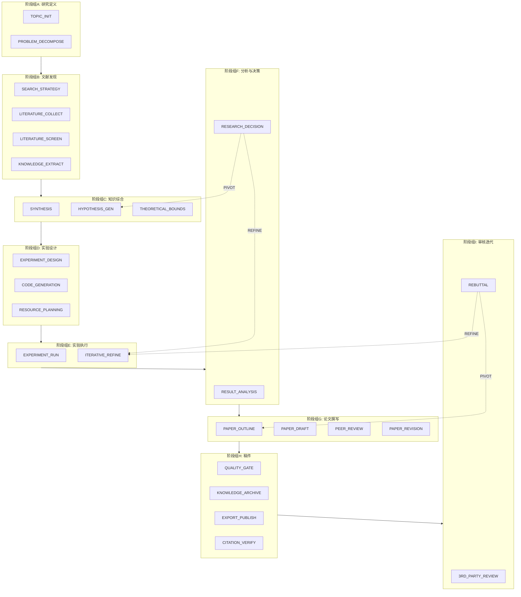

# AutoPaperBot

🤖 **让AI Agent自主完成严谨的学术论文写作**

[](LICENSE)
[](CONTRIBUTING.md)

## 📖 项目简介

AutoPaperBot 是一个基于 AI Agent 的自动化论文写作框架。它通过精心设计的流水线机制，让 AI Agent（如 Claude Code、Roo Code、Codex、Copilot 等）能够自主完成从选题调研到论文撰写的全流程工作。

### ✨ 核心优势

| 特性 | AutoPaperBot | 传统一句话Prompt | 代码化自动论文工具 |
|------|-------------|-----------------|-------------------|
| **鲁棒性** | ✅ 高（多阶段验证） | ❌ 低 | ⚠️ 中等 |
| **学术严谨性** | ✅ 高（门控审查） | ❌ 低 | ⚠️ 中等 |
| **Agent自主性** | ✅ 完全自主 | ⚠️ 有限 | ❌ 受限 |
| **部署难度** | ✅ Clone即用 | ✅ 简单 | ❌ 复杂配置 |
| **可定制性** | ✅ 高度可定制 | ❌ 低 | ⚠️ 中等 |

## 🏗️ 系统架构

AutoPaperBot 采用 **25个阶段、9个阶段组** 的流水线架构：



### 🔄 决策循环机制

流水线并非简单的线性流程，而是包含智能决策循环：

- **REFINE**: 返回优化（如实验数据不足时返回第13阶段）
- **PIVOT**: 方向调整（如假设不成立时返回第8阶段）
- **门控审查**: 阶段5、9、20可暂停等待人工审批

## 📁 项目结构

```
AutoPaperBot/
├── MEGA_PROMPT.md          # 核心提示词，定义流水线和约束
├── RESTRICTS.yaml          # 约束清单和反模式规则
├── README.md               # 项目说明文档
├── skill.md                # Claude Skill文件，供AI Agent参考
├── 论文写作心得.md           # 详细论文写作经验文档
├── resource/               # 资源文件目录
│   ├── 会议纪要.txt         # 实验室论文写作会议记录
│   └── *.pdf               # 论文写作分享PPT
├── code/                   # 实验代码目录
├── data/                   # 输入数据目录
├── docs/                   # 论文文档目录
│   ├── 实验构想参考.md      # 实验设计方案
│   ├── 文献方向和可能的问题.md  # 相关工作和审稿问题防御
│   └── 论文整体构想.md       # 论文大纲
├── paper/                  # 论文写作目录
│   ├── COLM_2026_TEMPLATE/ # 目标会议LaTeX模板
│   └── mypaper/            # 论文撰写工作区
│       ├── figures/        # 图表目录
│       ├── sections/       # 论文章节
│       └── main.tex         # 主文件
├── plans/                  # 阶段计划文件
└── results/                # 实验结果数据
```

## 🚀 快速开始

### 1. 克隆项目

```bash
git clone https://github.com/ouyangyipeng/AutoPaperBot.git
cd AutoPaperBot
```

### 2. 配置环境变量

```bash
export OPENAI_API_BASE="your_api_base_url"
export OPENAI_API_KEY="your_api_key"
export OPENAI_MODEL_NAME="your_model_name"
export KAGGLE_API_TOKEN="your_kaggle_token"  # 可选
export TAVILY_API_KEY="your_tavily_key"       # 可选
```

### 3. 配置论文信息

编辑 `MEGA_PROMPT.md` 中的论文信息部分：

```yaml
- **论文标题:** <你的论文标题>
- **目标会议:** <目标会议名称>
- **截稿日期:** <截稿日期>
```

### 4. 准备文档

在 `docs/` 目录下准备：
- 实验设计方案
- 文献调研和问题防御
- 论文整体构想

### 5. 启动Agent

将 `MEGA_PROMPT.md` 的内容作为系统提示词提供给 AI Agent，即可开始自动论文写作流程。

## 🎯 核心特性

### 🔒 真实性保障

- **反幻觉机制**: 严禁使用随机数伪造实验结果
- **真实算法**: 必须实现真实的数学运算和优化算法
- **收敛门控**: 必须实现真实的收敛停止准则
- **文献保真**: 引用必须来自真实数据库（OpenAlex、Semantic Scholar、arXiv）

### 📊 质量控制

- **门控阶段**: 关键节点可暂停等待人工审批
- **多Agent审核**: 独立上下文进行客观分析
- **第三方评审**: 最严苛的外部专家评审机制
- **证据一致性**: 论文内容与实验数据逐行比对

### ⏱️ 资源管理

- **时间估算**: 实验前进行小规模Pilot推算总时间
- **动态缩放**: 根据条件数量自动调整实验规模
- **优雅中断**: 达到资源预算80%时保存部分数据并停止

## 🛠️ 支持的AI Agent

| Agent | 支持状态 | 推荐指数 |
|-------|---------|---------|
| Claude Code | ✅ 完全支持 | ⭐⭐⭐⭐⭐ |
| Roo Code | ✅ 完全支持 | ⭐⭐⭐⭐⭐ |
| GitHub Copilot CLI | ✅ 完全支持 | ⭐⭐⭐⭐ |
| OpenAI Codex | ✅ 完全支持 | ⭐⭐⭐⭐ |
| 其他兼容Agent | ✅ 理论兼容 | ⭐⭐⭐ |

## 📝 论文写作规范

### 结构要求

1. **Introduction** (800-1000字): 研究背景、问题定义、核心贡献
2. **Related Work**: 相关领域分析，突出创新点
3. **Methodology** (1000-1500字): 设计原理、核心机制、实现细节
4. **Experiments**: 实验设计、结果分析、消融实验
5. **Discussion**: 意义、局限性、未来方向
6. **Conclusion**: 总结与展望

### 质量红线

- ❌ 禁止编造不存在的功能或特性
- ❌ 禁止使用随机数伪造实验数据
- ❌ 禁止引用不存在的文献
- ✅ 必须包含消融实验
- ✅ 基线必须经过同等精力的超参数调优

## 🤝 贡献指南

欢迎提交 Issue 和 Pull Request！

1. Fork 本仓库
2. 创建特性分支 (`git checkout -b feature/AmazingFeature`)
3. 提交更改 (`git commit -m 'Add some AmazingFeature'`)
4. 推送到分支 (`git push origin feature/AmazingFeature`)
5. 提交 Pull Request

## 📄 许可证

本项目采用 MIT 许可证 - 详见 [LICENSE](LICENSE) 文件

## 🙏 致谢

感谢所有 AI Agent 工具的开发者，让自动化论文写作成为可能。

---

**⚠️ 免责声明**: 本工具旨在辅助学术研究，提高论文写作效率。使用者需确保论文内容的原创性和学术诚信，遵守目标会议的投稿规范和学术道德准则。